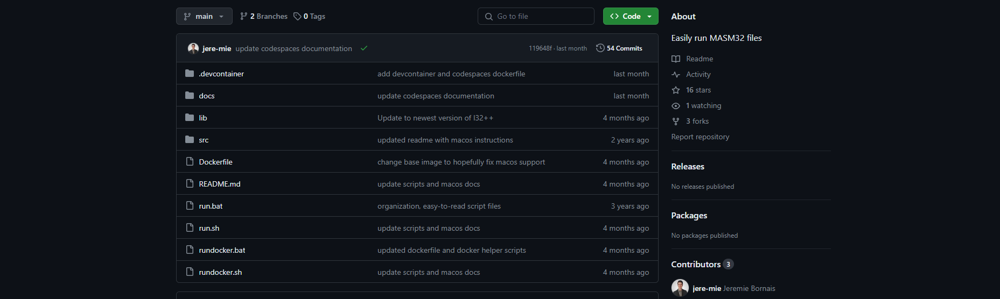
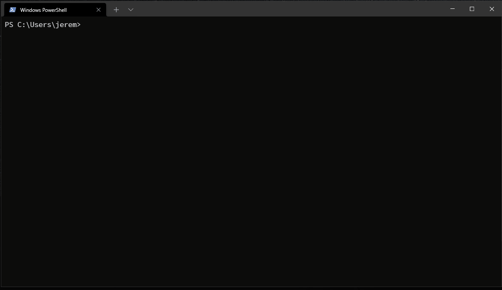

# Easy-MASM

Presented by Jeremie Bornais

---

# Agenda

- What is Easy-MASM
- Why you should use Easy-MASM
- How to use Easy-MASM
- Tips & Tricks
- Questions
- Interactive Demo


---

# What is Easy-MASM?

Easy-MASM is the simplest way to assemble, link, and run masm32 files for COMP-2660.

It works on Windows out of the box, Linux with WINE installed, and MacOS thanks to Docker.

You can also run it on popular online IDEs like GitHub Codespaces and Gitpod

<style>
.image-container {
    display: flex;
}

.image-container img {
    max-width: 100%; /* Make sure the images don't exceed their container */
    margin-right: 10px; /* Add some space between the images */
}
</style>

<div class="image-container">
  
  
</div>

---

# Why use Easy-MASM?

1. Easy-MASM is quick to set up, it only takes three easy steps to get started.
2. It is lightweight and small to download at less than 8mb! (As opposed to Visual Studio which is several GB in size)
3. It is cross-platform. Whether you're on Windows or Linux, you can use Easy-MASM (Mac users can use Easy-MASM too via Docker, GitHub Codespaces, SSH into the CS Servers, No Machine, etc.)
4. You can use any text editor you want. Whether it's VS Code, Notepad++, or Vim, Easy-MASM does not discriminate

<div style="display: flex;">


</div>

---

# Three Easy Steps to Get Started

1. Clone or download the Easy-MASM GitHub repo found at: https://github.com/jere-mie/easy-masm
2. Edit the “source.asm” file (or create your own .asm file) in the “src” folder
3. Run your program from the Command Prompt or PowerShell using `.\run source`



---

# See Easy-MASM in Action



---

# For Linux Users

If you're a Linux user, there's one extra step before you can get Easy-MASM working. You just need to install wine. Wine allows Windows programs to run on non-Windows machines. We use it to run the necessary dev tools on Linux.

Depending on your distribution, the steps you need to take to install wine may vary. However, if you're on a Debian based distro (Ubuntu, Mint, PopOS, etc.) you can run the following commands:

```sh
sudo dpkg --add-architecture i386 && sudo apt update
sudo apt install \
      wine \
      wine32 \
      wine64 \
      libwine \
      libwine:i386 \
      fonts-wine
```

Once wine is installed, you'll be able to run `run.sh` and Easy-MASM will work like normal!

---

# For MacOS Users

MacOS users are particularly disadvantaged when trying to install wine or Easy-MASM. However, thanks to Docker, there is a way to get Easy-MASM running locally.

You'll need to install Docker (https://docs.docker.com/desktop/install/mac-install/) on your system, and after it's running, you'll be able to run Easy-MASM via the `rundocker.sh` file.

## Alternatives

MacOS users have several alternatives to Docker if they wish to pursue them:

1. Use an online IDE like GitHub Codespaces or Gitpod
2. SSH into a Linux or Windows server and run Easy-MASM there (you can SSH into the CS Servers if you wish)
3. Create a lightweight Linux or Windows virtual machine, on which you can install Easy-MASM

My recommendation to MacOS users is to use GitHub Codespaces, as it's the easiest and smoothest method.

---

# Tips for Working With Easy-MASM

- If using VSCode, check out this extension for MASM syntax highlighting:
  - [marketplace.visualstudio.com/items?itemName=blindtiger.masm](https://marketplace.visualstudio.com/items?itemName=blindtiger.masm)
- If you're using GitHub Codespaces, Linux, or MacOS, be prepared to see several errors when running MASM programs. This is just wine (the underlying compatibility layer) doing its job. As long as you see the expected output, you're good!
- If you're using GitHub Codespaces, make sure you're regularly committing and pushing your code to your repository. You may also want to consider using a **private repository** so your classwork is kept private. 

---

# Have any Questions?

Feel free to reach out to me at [borna113@uwindsor.ca](mailto:borna113@uwindsor.ca) or on Discord!

## Resources

<br/>

### [github.com/jere-mie/easy-masm](https://github.com/jere-mie/easy-masm)

GitHub Repo

<br/>

### [jere-mie.github.io/easy-masm](https://jere-mie.github.io/easy-masm)

Documentation on GitHub

---

# Interactive Demo

